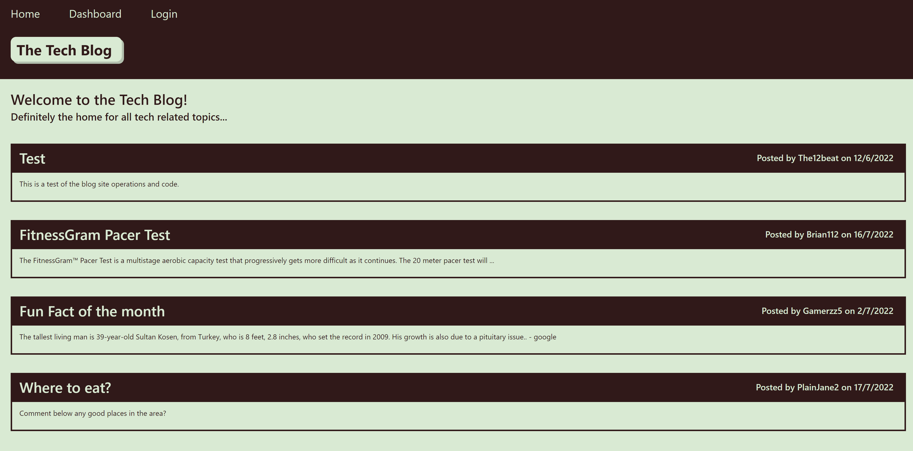

# Module 14 - Tech Blog

## Description

a CMS-style blog site to publish articles, blog posts etc matching a particular style.

## Table of Contents 

* [Installation](#installation-instructions)

* [Usage](#usage-information)

* [License](#license)

* [Contributing](#contributing-guidelines)

* [Tests](#test-instructions)

* [Questions](#questions)

* [Link to site](#link-to-site)

## Installation Instructions

Please follow these steps when running this application.   1. git clone the repository to your local machine.  2. Open the '.env.example' file and fill in your credentials then rename the file to '.env'  3. In terminal, CD into the db folder.  4. type mysql -u (username) -p then hit enter, then enter your password.  5. type source ./schema.sql then hit enter. The schema will run and create the database. (type quit in terminal after)  6. In terminal again, CD out of db into the application's folder.  7. Type and enter 'npm install' to install the dependencies.  8. if you want to have example seed data for your database type 'npm run seed'.  9. Type and enter 'node server.js' to run the application, the application will be live on your localhost.

## Usage Information

This project should be used as an example of handlebars functioning together with a sequelized application deployed to a live site and/or provides an open source code for users to see how to create an application similar to this one.

Sample:

## License

MIT: Permissive free license software. Please visit https://opensource.org/licenses/MIT for more information.
  
## Contributing Guidelines

Flipper5001 was the sole contributer for this project. If you wish to make any contributions, please refer to the questions section for our contact information.

## Test Instructions

The application connects to a database to store login and signup information. The databsae has been tested to ensure the information is input correctly.

## Questions

Other works can be found on https://github.com/Flipper5001.

If you have any questions or queries, please contact the following email address and we will get back to you as soon as possible.  
placeholder@gmail.com

## Link to site
https://m14-tech-blog.herokuapp.com/

